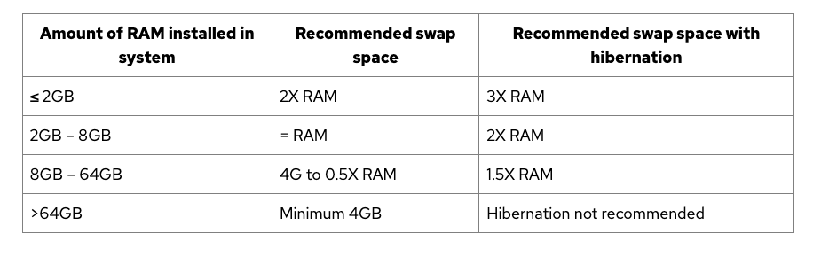
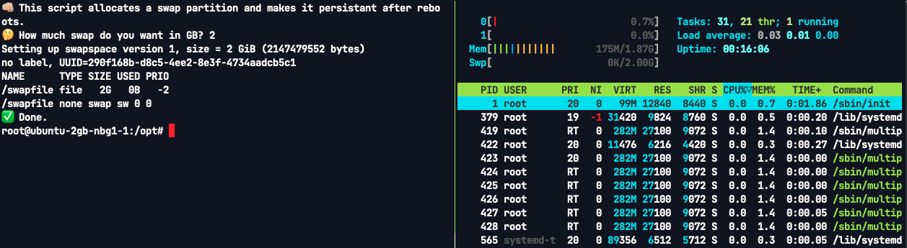

# create-swap

Create a swap partition in linux using swapfile method

## Run

- Copy and paste this line in your shell:

```bash
bash <(curl -sSL "https://raw.githubusercontent.com/AlirezaBaratian/create-swap/main/create_swap.sh")
```

- Enter the swap amount you want [Guide](https://opensource.com/article/19/2/swap-space-poll)



## Screenshots

Here's the final result with a 2 GB swap:


